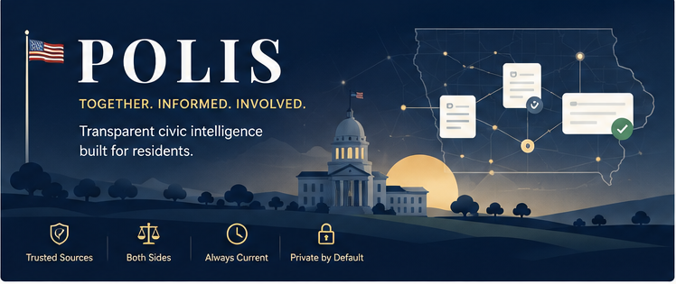
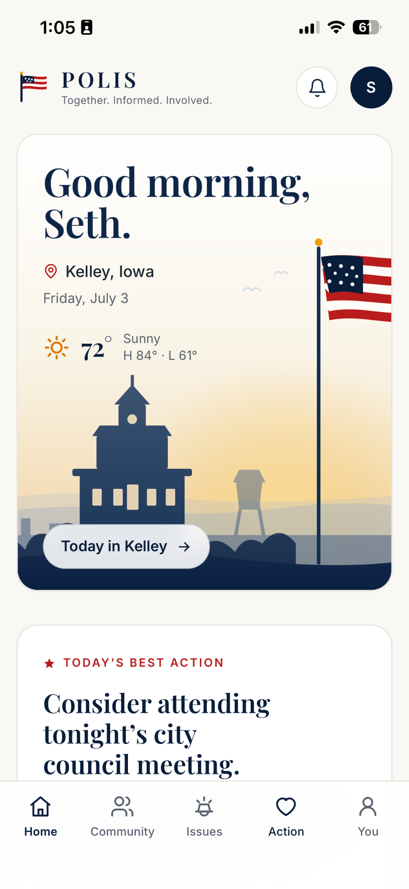
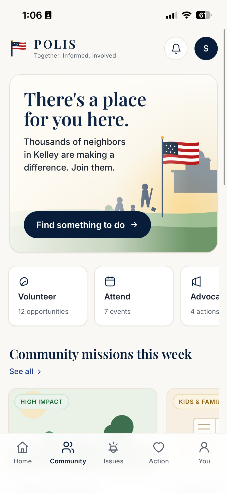
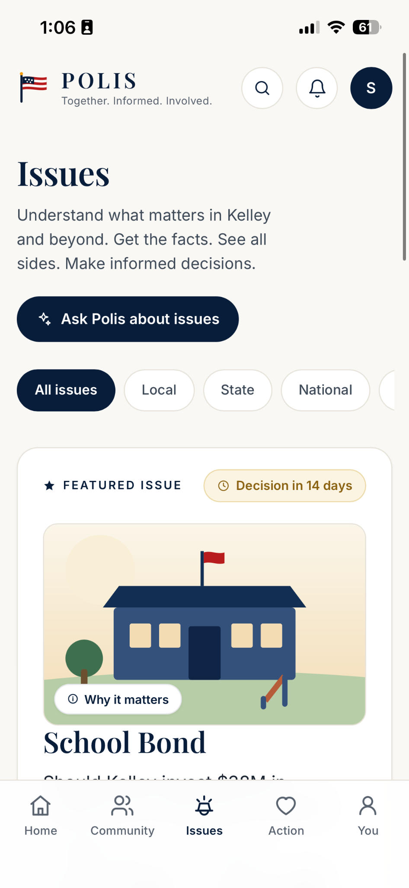
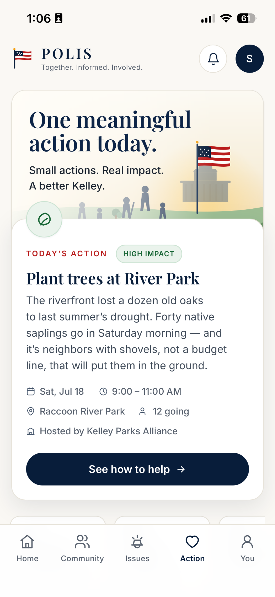
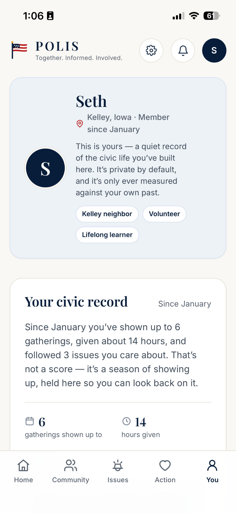
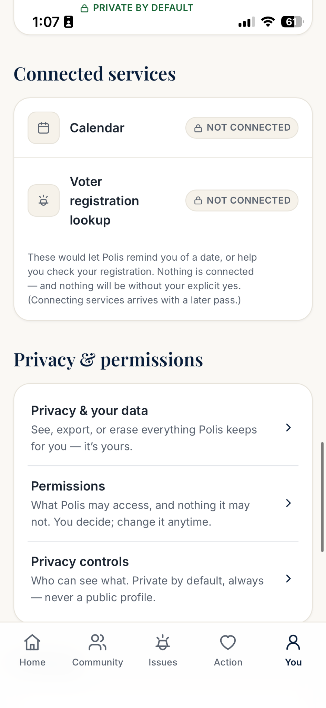
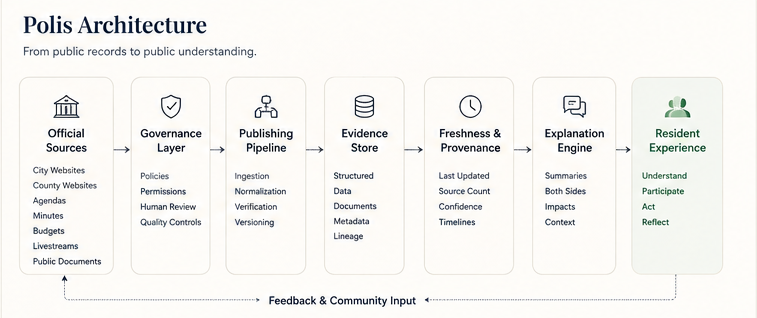
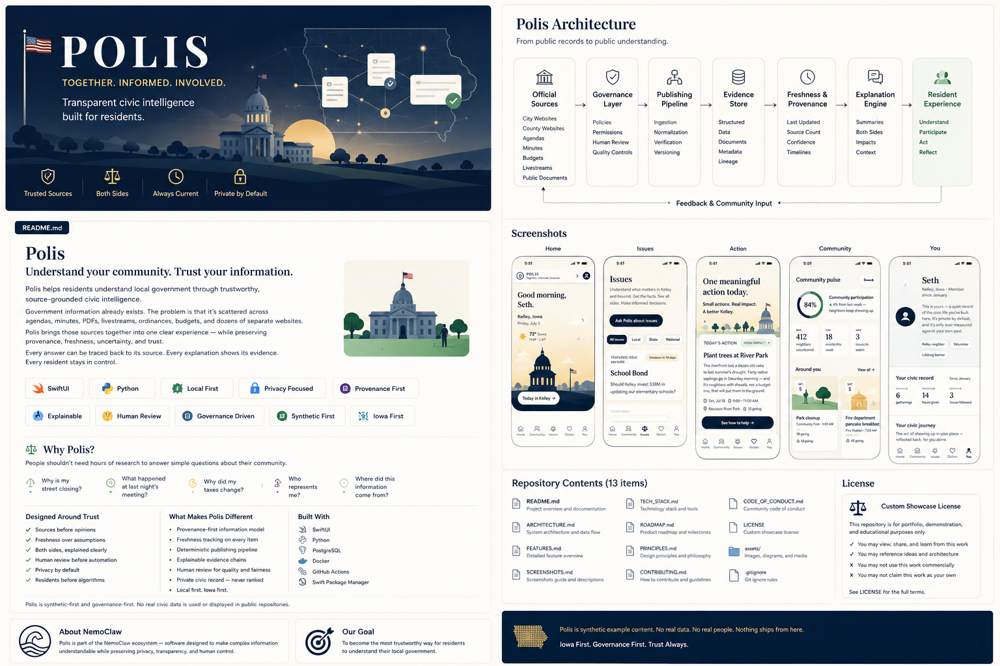

  

<h1 align="center">Polis</h1>

  <strong>Polis helps residents understand local government through trustworthy, source-grounded civic intelligence.</strong>

  
  
  
  
  
  
  

---

Government information already exists.

The problem is that it is scattered across agendas, minutes, budgets, ordinances, livestreams, public notices, and dozens of separate websites.

Polis brings those sources together into one understandable experience while preserving provenance, freshness, uncertainty, and human review.

Instead of asking residents to trust the software, Polis shows them why each answer should be trusted.

## Contents

- [Government Information Exists. Understanding It Does Not.](#government-information-exists-understanding-it-does-not)
- [The Resident Experience](#the-resident-experience)
- [System Architecture](#system-architecture)
- [Engineering Highlights](#engineering-highlights)
- [Designed Around Trust](#designed-around-trust)
- [What Polis Refuses to Be](#what-polis-refuses-to-be)
- [Technology](#technology)
- [My Role](#my-role)
- [Synthetic-First Showcase](#synthetic-first-showcase)
- [Public Showcase, Private Source](#public-showcase-private-source)
- [Part of the NemoClaw Ecosystem](#part-of-the-nemoclaw-ecosystem)
- [The Goal](#the-goal)
- [Related Documents](#related-documents)

## Government Information Exists. Understanding It Does Not.

People should not need hours of research to answer simple questions about their community:

- What happened at last night's council meeting?
- Why is my street closing?
- Why did my taxes change?
- Who represents me?
- What can I do to help?
- Where did this information come from?

Polis exists to make public information genuinely accessible without sacrificing accuracy, neutrality, or transparency.

## The Resident Experience

Polis is organized around four connected civic needs.

### Understand

Follow issues through timelines, sources, evidence, and balanced explanations.

### Participate

Find public meetings, volunteer opportunities, community events, and practical ways to contribute.

### Discover

Explore local organizations, representatives, public decisions, and nearby opportunities.

### Reflect

Keep a private, user-controlled record of civic participation — without scores, streaks, rankings, or public profiles.

<table>
  <tr>
    <td align="center"></td>
    <td align="center"></td>
    <td align="center"></td>
  </tr>
  <tr>
    <td align="center"><strong>Home</strong></td>
    <td align="center"><strong>Community</strong></td>
    <td align="center"><strong>Issues</strong></td>
  </tr>
</table>

<table>
  <tr>
    <td align="center"></td>
    <td align="center"></td>
    <td align="center"></td>
  </tr>
  <tr>
    <td align="center"><strong>Action</strong></td>
    <td align="center"><strong>Your Civic Record</strong></td>
    <td align="center"><strong>Privacy</strong></td>
  </tr>
</table>

<em>Screens show synthetic example content. See <a href="#synthetic-first-showcase">Synthetic-First Showcase</a>.</em>

## System Architecture

  

Polis separates official-source acquisition, governance, normalization, evidence storage, freshness, provenance, explanation, and presentation. This structure makes trust requirements part of the system rather than a label added afterward.

  
<strong>One-image overview</strong> — an illustrative single-graphic summary of the concept, architecture, and design

   
  

    
  

  
<em>Illustrative design summary. Content is synthetic and conceptual — not a literal manifest of this repository.</em>

## Engineering Highlights

- Source-grounded civic information architecture
- Provenance-first evidence model
- Freshness and staleness tracking
- Explicit confidence and uncertainty
- Governance before ingestion or publication
- Human review workflows
- Deterministic publishing pipeline
- Structured civic-data normalization
- Jurisdiction-aware architecture
- Explainable evidence chains
- Resident-facing issue timelines
- Private civic-memory controls
- Synthetic-first development
- Extensive automated testing
- Iowa-first expansion strategy

## Designed Around Trust

Polis was not designed to maximize engagement. It was designed to maximize understanding.

### Sources Before Opinions

Important civic claims remain connected to official evidence.

### Freshness Before Assumption

Residents should know when information was last reviewed and whether it may be stale.

### Both Sides, Explained Clearly

Polis is built to present relevant perspectives fairly, without turning uncertainty into false balance.

### Participation Before Polarization

The product emphasizes learning, attending, volunteering, contacting representatives, and helping locally.

### Private Before Public

Civic activity belongs to the resident. It is private by default, exportable, and erasable.

### Human Judgment Before Automation

Automation supports review and understanding. It does not silently replace accountable decisions.

### Local Before National

Polis begins with the places where civic life is most tangible: neighborhoods, cities, counties, and communities.

## What Polis Refuses to Be

Polis is not a campaign platform.

It is not a persuasion engine.

It is not an outrage-driven news feed.

It is not a public ranking system for civic participation.

It is not a chatbot that hides uncertainty behind confident language.

It is civic infrastructure designed to help residents understand, participate, and remain in control.

## Technology

`Swift` · `SwiftUI` · `Python` · `structured data models` · `evidence pipelines` · `governance systems` · `automated testing` · `Git` · `GitHub`

## My Role

I conceived the product, defined its civic-trust principles, directed its architecture and implementation campaigns, designed the resident experience, evaluated product and governance decisions, and built the system through iterative engineering, testing, and documentation.

The project demonstrates product strategy, systems architecture, civic information design, privacy-conscious development, governance, testing strategy, technical direction, and long-term execution.

## Synthetic-First Showcase

The screens in this repository use synthetic example content. They do not represent real meetings, people, votes, statistics, or civic claims. Place names, figures, and events shown are illustrative.

## Public Showcase, Private Source

This is a **public, recruiter-facing showcase repository**. It presents the concept, architecture, resident experience, and engineering philosophy of Polis.

The production source code, private development history, credentials, internal prompts, security details, and non-public implementation are intentionally maintained in **separate private repositories** and are not included here.

## Part of the NemoClaw Ecosystem

**[NemoClaw](https://github.com/happySNAG/nemoclaw-portfolio)** is a portfolio of trustworthy software systems built around evidence, provenance, consent, and human authority.

- **[Skippy](https://github.com/happySNAG/Skippy-AI-Companion)** — human-centered personal AI
- **Polis** — governed civic intelligence · *you are here*
- **[World](https://github.com/happySNAG/World-Knowledge-Engine)** — source-grounded knowledge infrastructure
- **[Crate](https://github.com/happySNAG/Crate-Music-Stewardship)** — local-first digital stewardship

Each project keeps its own identity and stack. What they share is the engineering posture, not a runtime.

**[Explore the full ecosystem →](https://github.com/happySNAG/nemoclaw-portfolio)**

## The Goal

> **To become the most trustworthy way for residents to understand and participate in their local government.**

## Related Documents

- [PROJECT_SUMMARY.md](PROJECT_SUMMARY.md) — portfolio and résumé summary
- [ENGINEERING_PHILOSOPHY.md](ENGINEERING_PHILOSOPHY.md) — the principles behind the build
- [LICENSE](LICENSE) — viewable showcase terms
</content>
